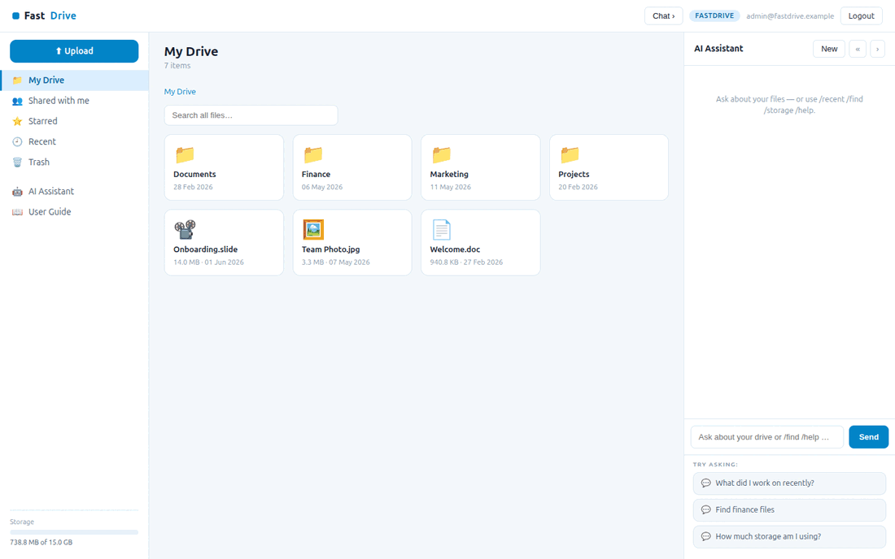

# FastDrive

**FastDrive** is an open-source **file-management app** built with
[FastHTML](https://fastht.ml) — a server-side, HTMX-driven port of the core of
[Frappe Drive](https://github.com/frappe/drive). Python-first, no JavaScript
framework: a file/folder browser with breadcrumbs, shared / starred / recent /
trash views, file detail with shares + activity, upload, and an AI assistant
grounded in the (synthetic) tree.

*Your files, organised.* Runs on port **5012**.

> **Synthetic data only.** Files are synthetic **metadata** (no bytes on disk),
> generated by `seed.py`.

## Demo



## Quickstart (native)

```bash
python -m venv .venv
.venv/bin/python -m pip install -r requirements.txt
cp .env.sample .env          # add an LLM key for free-form AI chat
.venv/bin/python web_app.py  # http://localhost:5012  (self-seeds on first boot)
```

Login: `admin@fastdrive.example` / `FastDrive2026$`. Rebuild the tree with
`.venv/bin/python seed.py`.

## Run with Docker

```bash
docker compose up --build      # http://localhost:5012
```

`Dockerfile` (python:3.12-slim, port 5012) seeds on first boot;
`docker-compose.yml` mounts a `fastdrive-data` volume at `/data`.

## Module tour

- **My Drive** (`/`) — folders and files as tiles with breadcrumbs; **search
  across all files**; a sidebar **storage bar**.
- **File detail** (`/e/{id}`) — type, size, owner, location, **who it's shared
  with** (Viewer/Editor), and an **activity history**.
- **Shared / Starred / Recent / Trash** — quick views into your drive.
- **Upload** (`/upload`) — add a file (demo — metadata only) to My Drive.
- **AI Assistant** (right rail) — file Q&A grounded in a live snapshot;
  slash-commands `/recent`, `/find <text>`, `/storage`, `/shared` work with **no key**.

## Architecture

```
web_app.py        routes, auth, upload, SSE chat, boot
db.py             SQLite tree (self-referential entities) + shares + activity
seed.py           deterministic synthetic folder tree + shares + activity
web/layout.py     3-pane shell, storage bar, CSS, chat JS
web/views.py      folder browser, file detail, filtered views, upload
web/ai.py         grounded chat + slash-commands
```

See **[SKILLS.md](SKILLS.md)** for the capability reference + migration playbook,
and **[docs/ROADMAP.md](docs/ROADMAP.md)** for the comparison vs Frappe Drive.
Part of the
[`fasthtml-oss-migrations`](https://github.com/predictivelabsai/fasthtml-oss-migrations)
initiative.

## Licence

MIT.
