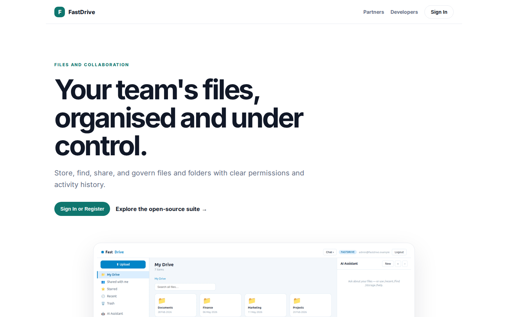
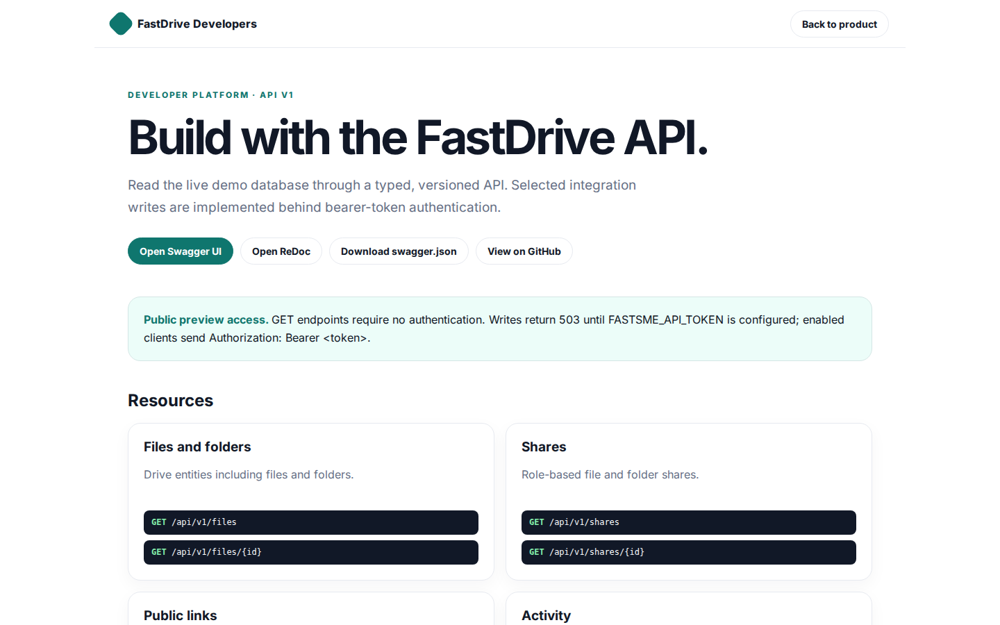

# FastDrive Platform Guide

**Published:** 2026-08-19
**Platform:** [https://drive.fastsme.com](https://drive.fastsme.com)
**Source:** [github.com/predictivelabsai/FastDrive](https://github.com/predictivelabsai/FastDrive)

## Platform overview

**FastDrive** is an open-source **file-management app** built with — a server-side, HTMX-driven port of the core of . Python-first, no JavaScript framework: a file/folder browser with breadcrumbs, shared / starred / recent / trash views, file detail with shares + activity, upload, and an AI assistant grounded in the (s

This visual guide was reviewed against the live product using Playwright. Screens and available navigation can vary by account, role, and deployment configuration.

## 1. Your team's files, organised and under control.

FILES AND COLLABORATION Your team's files, organised and under control. Store, find, share, and govern files and folders with clear permissions and activity history. Sign In or Register Explore the open-source suite → Product tour · see the workspace in action

Screen reviewed at: [https://drive.fastsme.com/](https://drive.fastsme.com/)

## 2. Build with the FastDrive API.

FastDrive Developers Back to product DEVELOPER PLATFORM · API V1 Build with the FastDrive API. Read the live demo database through a typed, versioned API. Selected integration writes are implemented behind bearer-token authentication. Open Swagger UI Open ReDo

Screen reviewed at: [https://drive.fastsme.com/developers](https://drive.fastsme.com/developers)

## 3. Sign in

Sign in with Google Sign in to continue to fastsme.com Email or phone Forgot email? Next Create account Afrikaans azərbaycan bosanski català Čeština Cymraeg Dansk Deutsch eesti English (United Kingdom) English (United States) Español (España) Español (Latinoam

Screen reviewed at: [https://accounts.google.com/v3/signin/identifier?opparams=%253F&dsh=S-434008222%3A1787122695321107&access_type=online&client_id=887059023987-2a7spj1m82eivobdbt1itb3cqca6tpt1.apps.googleusercontent.com&o2v=2&prompt=select_account&redirect_uri=https%3A%2F%2Fdrive.fastsme.com%2Fauth%2Fgoogle%2Fcallback&response_type=code&scope=openid+email+profile&service=lso&state=v82A9uNtd08zZSAmHMS0TcF0lBQy9ovtd8juEfr2rXE&flowName=GeneralOAuthLite&continue=https%3A%2F%2Faccounts.google.com%2Fsignin%2Foauth%2Flegacy%2Fconsent%3Fauthuser%3Dunknown%26part%3DAJi8hAM1c9NwjXzNZS4cYgDbSavAY7acRD3cMZWMcNxmg4q3Hw9ZGPTPR2QMQTswU2Npf50zsmWvYy4HNJRVwLlJ9Gz4B_Rxyx4tHVrbe5WJiBg-jfCWmSSN4RzTIxXggbd_bSyNPHVTYUfXZ-_N4o9vURJ5bqHCnRBLzXGRDOe8LevrnjCyrCmVJCnfr6SP_vQQXHYQl6K5H04CnonYTcUHYTXPmzDeT12-qrHuVaqsisLBv1cfeLmAT1xwh4ihhXnmO0QOfQHYL4NQMHcFnQoAQ2v1Xr9hTBbxJmmWk_SJRh_wGYKCnyv-OdkDDOcl8XbD7l6Dp8FhpaizV6iQapcsljvWDGz1TbeXrdFqmQy3W663JIF0n5SMjhh1N9yOlw70x0IAjiJ8hNsoN6h6MjQnhyrCVVVO_QvruNGBFo596y3UKTaoZVGQAVq8Ii5tcfd4ZAPoLBKBXemdzF3F2OfRyscak38HEQ%26flowName%3DGeneralOAuthFlow%26as%3DS-434008222%253A1787122695321107%26client_id%3D887059023987-2a7spj1m82eivobdbt1itb3cqca6tpt1.apps.googleusercontent.com%23&app_domain=https%3A%2F%2Fdrive.fastsme.com&rart=ANgoxcfkGoQBpxJCNJ9ZHZeOO5titQMxMEnnW_82_90yiJ84Is0Oeviwapi5RS7h3QV1D-HoNJwfQSmLvSCZWg9CjsYRFgex2Uy2YrFA1zNxlnabMuSoLtQ](https://accounts.google.com/v3/signin/identifier?opparams=%253F&dsh=S-434008222%3A1787122695321107&access_type=online&client_id=887059023987-2a7spj1m82eivobdbt1itb3cqca6tpt1.apps.googleusercontent.com&o2v=2&prompt=select_account&redirect_uri=https%3A%2F%2Fdrive.fastsme.com%2Fauth%2Fgoogle%2Fcallback&response_type=code&scope=openid+email+profile&service=lso&state=v82A9uNtd08zZSAmHMS0TcF0lBQy9ovtd8juEfr2rXE&flowName=GeneralOAuthLite&continue=https%3A%2F%2Faccounts.google.com%2Fsignin%2Foauth%2Flegacy%2Fconsent%3Fauthuser%3Dunknown%26part%3DAJi8hAM1c9NwjXzNZS4cYgDbSavAY7acRD3cMZWMcNxmg4q3Hw9ZGPTPR2QMQTswU2Npf50zsmWvYy4HNJRVwLlJ9Gz4B_Rxyx4tHVrbe5WJiBg-jfCWmSSN4RzTIxXggbd_bSyNPHVTYUfXZ-_N4o9vURJ5bqHCnRBLzXGRDOe8LevrnjCyrCmVJCnfr6SP_vQQXHYQl6K5H04CnonYTcUHYTXPmzDeT12-qrHuVaqsisLBv1cfeLmAT1xwh4ihhXnmO0QOfQHYL4NQMHcFnQoAQ2v1Xr9hTBbxJmmWk_SJRh_wGYKCnyv-OdkDDOcl8XbD7l6Dp8FhpaizV6iQapcsljvWDGz1TbeXrdFqmQy3W663JIF0n5SMjhh1N9yOlw70x0IAjiJ8hNsoN6h6MjQnhyrCVVVO_QvruNGBFo596y3UKTaoZVGQAVq8Ii5tcfd4ZAPoLBKBXemdzF3F2OfRyscak38HEQ%26flowName%3DGeneralOAuthFlow%26as%3DS-434008222%253A1787122695321107%26client_id%3D887059023987-2a7spj1m82eivobdbt1itb3cqca6tpt1.apps.googleusercontent.com%23&app_domain=https%3A%2F%2Fdrive.fastsme.com&rart=ANgoxcfkGoQBpxJCNJ9ZHZeOO5titQMxMEnnW_82_90yiJ84Is0Oeviwapi5RS7h3QV1D-HoNJwfQSmLvSCZWg9CjsYRFgex2Uy2YrFA1zNxlnabMuSoLtQ)

## Getting started

Visit [https://drive.fastsme.com](https://drive.fastsme.com) to explore FastDrive. For source code and deployment details, use the GitHub link above.
